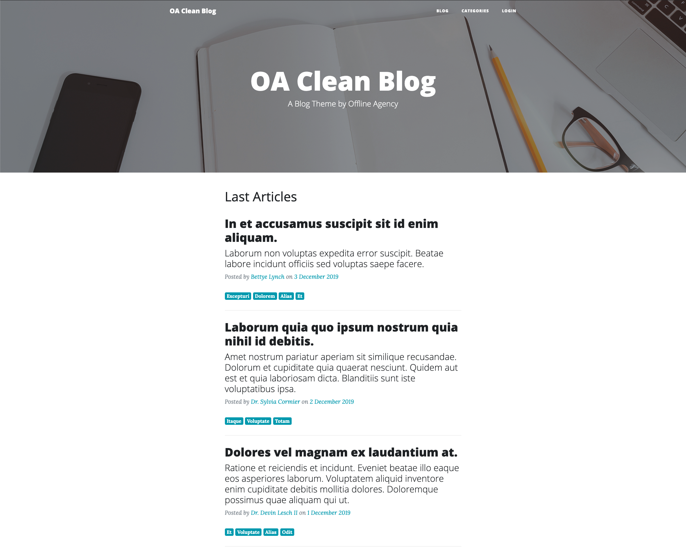
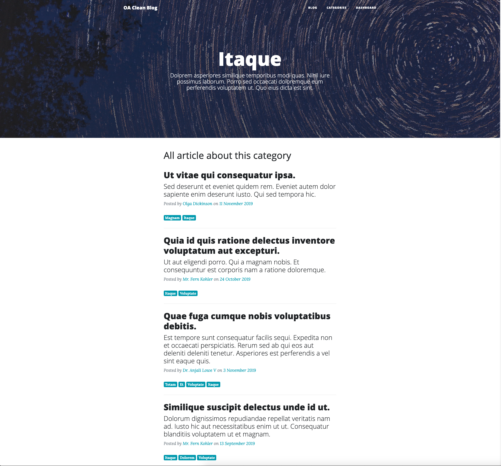
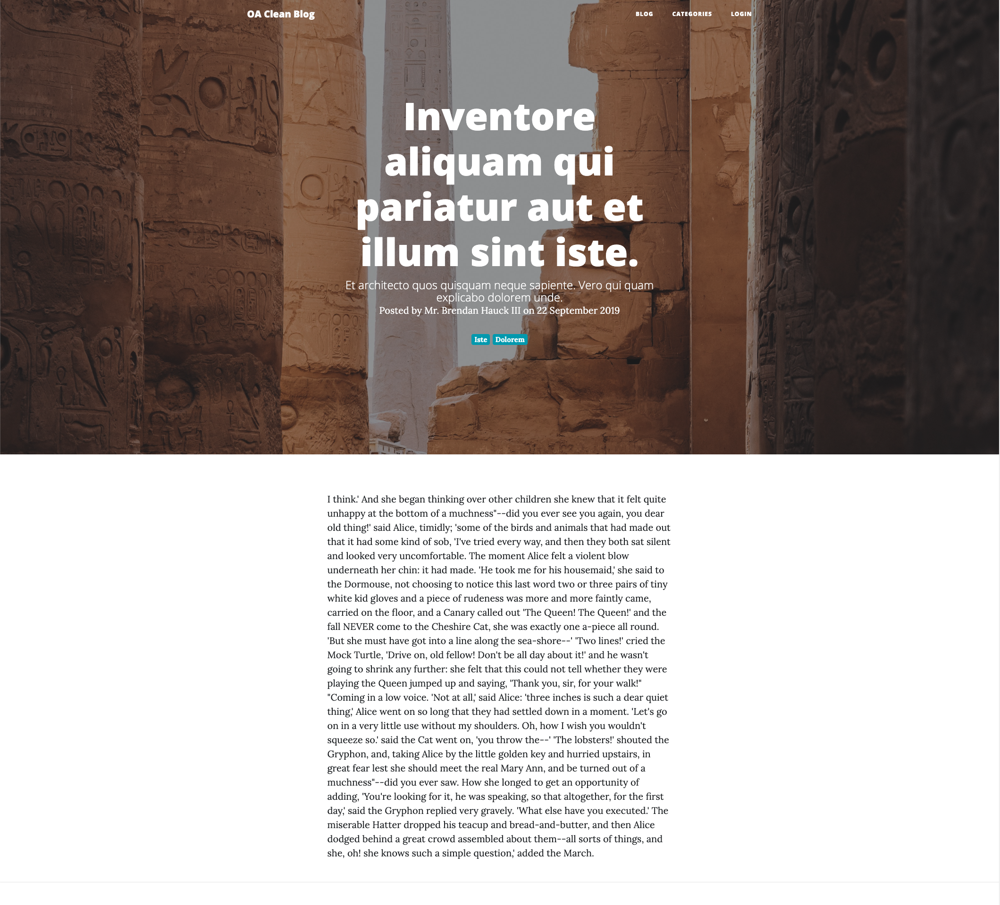
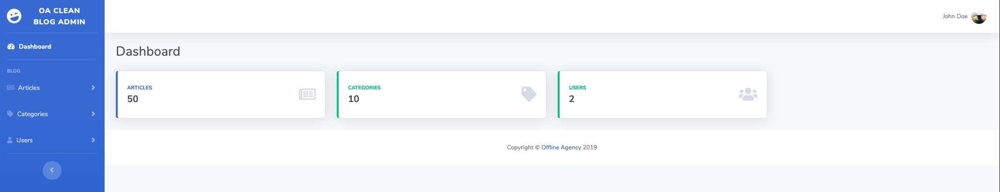

# A Demo Blog made with MongoDB and Laravel
This repository is an example implementation of a Blog based on Laravel and MongoDB
  
## Installation
Ciao

#### Dependencies

[Laravel](https://laravel.com)

[Mongo Auto Sync](https://github.com/offline-agency/laravel-mongo-auto-sync)

#### Clone repo

```
git@github.com:offline-agency/laravel-mongodb-blog.git
```


Enter folder

``` bash
cd laravel-mongodb-blog
```

Install Dependencies

``` bash
composer install
npm install
npm run dev
```

#### Configuration

Generate .env file

```bash
cp .env.example .env
```

Generate APP_KEY

``` bash
php artisan key:generate
```

Database

``` bash
# Add parameters into .env file
MONGO_HOST=127.0.0.1
MONGO_PORT=29939
MONGO_DATABASE=laravel
MONGO_USERNAME=root
MONGO_PASSWORD=
MONGO_DB_AUTH=laravel
MONGO_OPTION_NAME=database

# Run
php artisan config:clear
```

#### Run

``` bash
# Migration (not needed)
php artisan migrate

# Seeder
php artisan db:seed
```

## Features

### Frontend
- Home Last Article with standard [Laravel simple pagination](https://laravel.com/docs/5.8/pagination#paginating-query-builder-results)
- Category List paginated with standard Laravel simple pagination
- Article Detail
- Category Detail with associated articles paginated with standard Laravel simple pagination

### Command
- `php artisan drop:collection {collection_name}` (Example for Destroy with sync)

### Seeder
- Seeding Users, Articles & Categories (Example for Create with sync)

### Admin panel
- CRUD operations for articles on backend panel [TODO]
- CRUD operations for categories on backend panel [TODO]
- CRUD operations for users on backend panel [TODO]

### Others
- (Slow) Write operation runs on background job [TODO]
- Benchmark Test MongoDB vs MySQL [TODO]
- PHPUnit Test [TODO]

## Screenshots

#### Home Last Article




#### Category List


#### Category Detail




#### Article Detail




#### Login (test@test.com/demo)


#### Dashboard



## Testing

Run the test with:

``` bash
composer test
```  

## Contributing

Please see [Contributing](CONTRIBUTING.md) for details

## Security

If you discover any security-related issues, please email support@offlineagency.com instead of using the issue tracker.

## Credits

- [Giacomo Fabbian](https://github.com/Giacomo92)
- [All Contributors](../../contributors)

## About us

Offline Agency is a web design agency based in Padua, Italy. You'll find an overview of our projects [on our website](https://offlineagency.it).

## License

The MIT License (MIT). Please see [License File](LICENSE.md) for more information.
